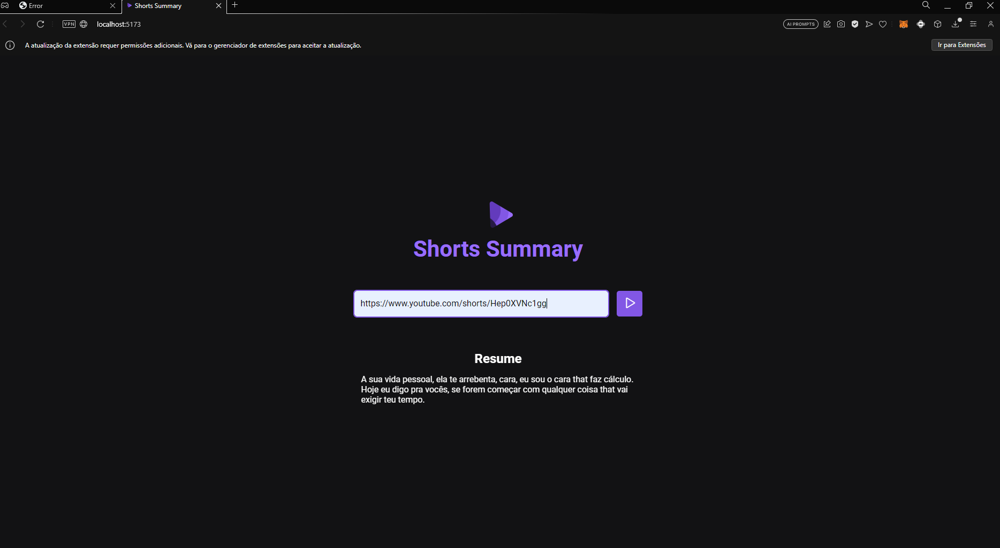

<h1 align="center"> Shorts Summary</h1>

Its a IA project that search a youtube shorts video, and transcribe the audio into a resume.   

  <a href="#-tecnologias">Techs/Tecnologias</a>&nbsp;&nbsp;&nbsp;|&nbsp;&nbsp;&nbsp;
  <a href="#-projeto">Project/Projeto</a>&nbsp;&nbsp;&nbsp;|&nbsp;&nbsp;&nbsp;
  <a href="#-layout">Layout</a>&nbsp;&nbsp;&nbsp;|&nbsp;&nbsp;&nbsp;
  <a href="#memo-licença">License/Licença</a>

  

## 🚀 Techs / Tecnologias

Esse projeto foi desenvolvido com as seguintes tecnologias:

- HTML e CSS
- JavaScript
- Node JS
- Inteligencia Artificial (IA)
- Bibliotecas 
- Git e Github

## 💻 Project / Projeto

Um projeto que une front end com back end. O cliente coloca o vídeo que deseja transcrever, após o "click" envia ao server back end, que junto com a IA faz a transcrição do video de mp4. para wav. e a IA faz o resumo. Projeto possui responsividade.

A project that combines front end with back end. The client places the video they want to transcribe, after the "click" it sends it to the back end server, which together with the AI ​​transcribes the mp4 video. to wav. and the AI ​​does the summarizing. This project have rresponsiveness.

## 🔖 Layout

Você pode visualizar o layout do projeto através do repositório. 

Feito com amor por Lara.
Made w/ love by Lara.